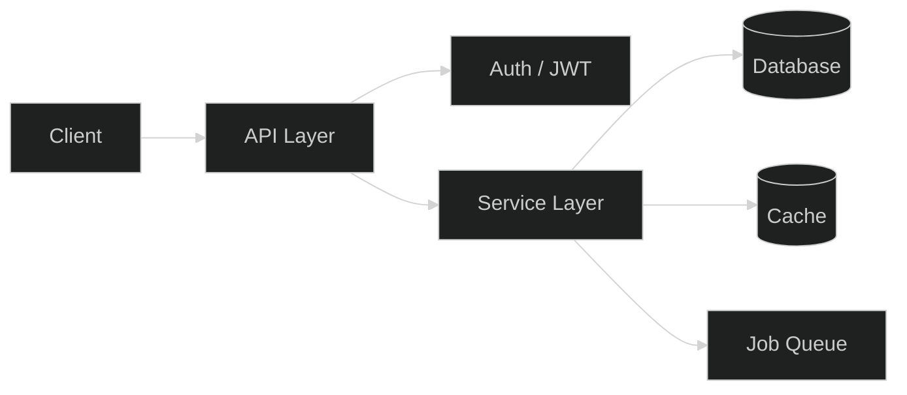
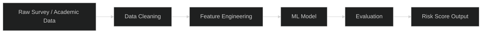
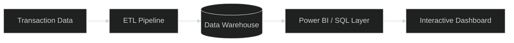
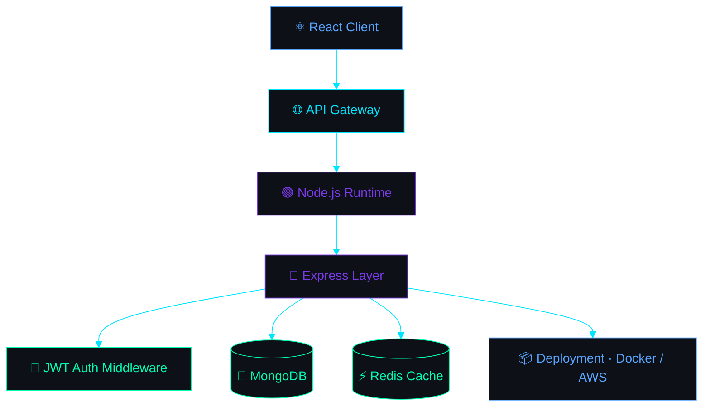
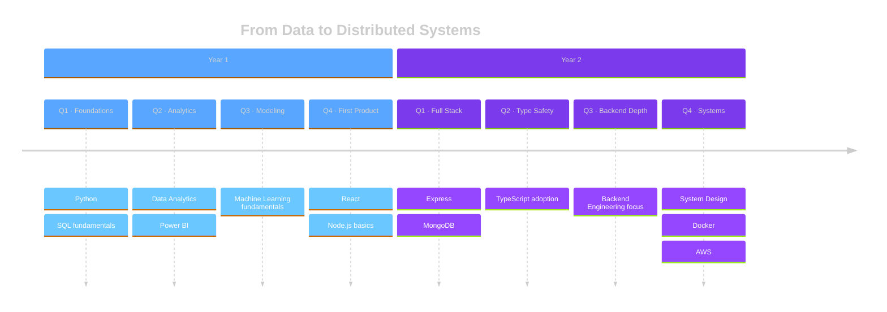

```mermaid
%%{init: {'theme':'dark', 'themeVariables': { 'primaryColor':'#161B22','primaryTextColor':'#58A6FF','primaryBorderColor':'#30363D','lineColor':'#7C3AED','secondaryColor':'#0D1117','tertiaryColor':'#0D1117'}}}%%
flowchart TD
    A["📊 Data Analytics<br/><small>Where the curiosity started</small>"] --> B["🤖 Machine Learning<br/><small>From patterns to predictions</small>"]
    B --> C["🐍 Python<br/><small>The common thread</small>"]
    C --> D["🗄️ SQL<br/><small>Structured thinking about data</small>"]
    D --> E["📈 Power BI<br/><small>Turning data into decisions</small>"]
    E --> F["⚛️ React<br/><small>First step into product engineering</small>"]
    F --> G["🟢 Node.js<br/><small>Bringing JS to the server</small>"]
    G --> H["🚀 Express<br/><small>Structuring real APIs</small>"]
    H --> I["🍃 MongoDB<br/><small>Persisting what matters</small>"]
    I --> J["🔷 TypeScript<br/><small>Trading speed for safety</small>"]
    J --> K["⚙️ Backend Engineering<br/><small>The current focus</small>"]
    K --> L["🏗️ System Design<br/><small>Thinking in components, not files</small>"]
    L --> M["☁️ Cloud<br/><small>Where it all has to survive</small>"]
    M --> N["🏭 Production Software<br/><small>The actual goal</small>"]

    style A fill:#0D1117,stroke:#58A6FF,color:#58A6FF
    style B fill:#0D1117,stroke:#7C3AED,color:#7C3AED
    style C fill:#0D1117,stroke:#00E5FF,color:#00E5FF
    style D fill:#0D1117,stroke:#00E5FF,color:#00E5FF
    style E fill:#0D1117,stroke:#00E5FF,color:#00E5FF
    style F fill:#0D1117,stroke:#58A6FF,color:#58A6FF
    style G fill:#0D1117,stroke:#58A6FF,color:#58A6FF
    style H fill:#0D1117,stroke:#58A6FF,color:#58A6FF
    style I fill:#0D1117,stroke:#58A6FF,color:#58A6FF
    style J fill:#0D1117,stroke:#7C3AED,color:#7C3AED
    style K fill:#0D1117,stroke:#00FFB3,color:#00FFB3
    style L fill:#0D1117,stroke:#00FFB3,color:#00FFB3
    style M fill:#0D1117,stroke:#00FFB3,color:#00FFB3
    style N fill:#0D1117,stroke:#00FFB3,color:#00FFB3
```

<div align="center">

<!-- ================================================================ -->
<!-- SECTION 01 — ANIMATED HERO                                        -->
<!-- ================================================================ -->


<br/>

<a href="#">
  
</a>

<br/><br/>


<br/><br/>

<sub><i>Scroll down — this profile is built like a system, not a page.</i></sub>

<br/>


</div>

<!-- ================================================================ -->
<!-- NAVIGATION ANCHORS (populated as sections are added)              -->
<!-- ================================================================ -->

<div align="center">

<a href="#terminal">Terminal</a> •
<a href="#about">About</a> •
<a href="#journey">Journey</a> •
<a href="#stack">Stack</a>

</div>

<br/>

<!-- ================================================================ -->
<!-- SECTION 02 — TERMINAL INTRODUCTION                                 -->
<!-- ================================================================ -->

<a id="terminal"></a>

<div align="center">

<table width="100%">
<tr>
<td>

<div style="background:#0D1117; border:1px solid #30363D; border-radius:10px; padding:0;">

<div style="background:#161B22; border-radius:10px 10px 0 0; padding:10px 16px; display:flex; align-items:center; border-bottom:1px solid #30363D;">


<code>&nbsp;&nbsp;yash@engineering:~</code>
</div>

```bash
$ whoami

> Yash Kagra
> Software Engineer · Backend Developer
> Machine Learning Enthusiast · Data Analyst

$ cat location.txt

> India

$ cat mission.txt

> Build scalable software that solves real-world problems.
> Ship things that are correct, maintainable, and fast — in that order.

$ cat currently_learning.json

{
  "language":  "TypeScript",
  "focus":     ["Backend Engineering", "Cloud", "System Design"],
  "tooling":   ["Docker", "AWS"],
  "status":    "actively building"
}

$ echo $UPTIME

> Engineering mindset compiling since day one. No errors. No warnings.
> Just continuous integration of knowledge.

$ _
```

</div>

</td>
</tr>
</table>

</div>

<br/>

<!-- ================================================================ -->
<!-- SECTION 03 — ABOUT ME                                              -->
<!-- ================================================================ -->

<a id="about"></a>

##  About Me

I didn't start with backend engineering — I started with a spreadsheet full of numbers that didn't make sense yet, and a stubborn need to make them make sense. That curiosity turned into data analytics, then machine learning, and somewhere in that process I realized I didn't just want to *analyze* systems — I wanted to *build* them.

That's the shift that defines how I work today. A model that predicts something well is interesting. A system that runs that prediction reliably, at scale, for real users, at 2 AM without paging anyone — that's the part I actually care about. So my focus moved from notebooks to servers, from `df.head()` to `docker-compose up`, from "does this work on my machine" to "does this survive production."

A few things stay constant no matter what I'm building:

- **Ownership over output.** I'd rather ship something smaller that I fully understand than something larger I merely assembled.
- **Curiosity as a habit, not a phase.** Every stack I've picked up — Python, SQL, React, Node, TypeScript — was learned because a real problem needed it, not because it was trending.
- **Software as craft.** Code is read far more often than it's written. I optimize for the engineer who inherits this six months from now — which is usually future me.
- **Systems thinking.** I care less about "does this feature work" and more about "what happens to this feature under load, under failure, under change."

I'm currently deep in backend engineering and system design, treating every project — including the ones below — as a rehearsal for building things that are genuinely production-grade, not just demo-grade.

<br/>

<!-- ================================================================ -->
<!-- SECTION 04 — SOFTWARE ENGINEERING JOURNEY                         -->
<!-- ================================================================ -->

<a id="journey"></a>

##  Software Engineering Journey

<div align="center">



<sub>Each stage fed the next — analytics taught me to ask the right questions, ML taught me to model answers, and engineering taught me to ship them.</sub>

</div>

<br/>

<!-- ================================================================ -->
<!-- SECTION 05 — TECH STACK                                            -->
<!-- ================================================================ -->

<a id="stack"></a>

##  Tech Stack

<table width="100%">
<tr><td width="50%" valign="top">

**Languages**


**Frontend**


**Backend**


**Databases**


</td><td width="50%" valign="top">

**Cloud & DevOps**


**Machine Learning & Analytics**

  

**Tools & Version Control**


**Operating Systems**


</td></tr>
</table>

<br/>

<!-- ================================================================ -->
<!-- SECTION 06 — ENGINEERING PHILOSOPHY                                -->
<!-- ================================================================ -->

##  Engineering Philosophy

> **Working code is the minimum bar, not the finish line.**
> I judge a piece of software by what it costs to change six months from now — not by how fast it shipped today.

| Principle | What it means in practice |
|---|---|
| **Quality over velocity, until velocity is the requirement** | I write tests and handle edge cases *before* they become production incidents, not after. |
| **Maintainability is a feature** | Every function I write is written for the next person reading it — usually a tired version of me. |
| **Scalability is a design decision, not an afterthought** | I ask "what happens at 10x load" while designing, not while debugging. |
| **Readable code is a form of respect** | Clever one-liners are a liability. Clear intent beats clever syntax every time. |
| **User experience doesn't stop at the UI** | A slow API is a bad user experience, even if the frontend looks perfect. |

<br/>

<!-- ================================================================ -->
<!-- SECTION 07 — CURRENT FOCUS                                         -->
<!-- ================================================================ -->

##  Current Focus

<table width="100%">
<tr>
<td width="25%" valign="top">

**🧠 Learning**

TypeScript, Docker, and AWS fundamentals — moving from "I can use this" to "I understand why this is designed this way."

</td>
<td width="25%" valign="top">

**🏗️ Building**

**Cable One** — a production-oriented system that's the current proving ground for everything in the philosophy above.

</td>
<td width="25%" valign="top">

**📚 Reading**

Notes and docs on distributed systems and system design — the kind of material that changes how you architect, not just what you code.

</td>
<td width="25%" valign="top">

**🎯 Practicing**

Data structures & algorithms and mock system design interviews, to keep the fundamentals sharp under pressure.

</td>
</tr>
</table>

<br/>

<!-- ================================================================ -->
<!-- SECTION 08 — FEATURED PROJECTS                                     -->
<!-- ================================================================ -->

##  Featured Projects

<br/>

<table width="100%">
<tr><td>

### 🔌 Cable One

**A production-oriented backend system built to handle real operational workflows at scale.**

 

<details>
<summary><b>Architecture</b></summary>
<br/>



</details>

**Tech Stack:** Node.js · Express · MongoDB · TypeScript · Docker

**Features:** Modular service layer, role-based access control, background job processing, structured error handling and logging.

**Challenges:** Designing a data model flexible enough for evolving business requirements without turning into an untyped free-for-all.

**Lessons:** Enforcing boundaries between layers early saves far more time than it costs — the discipline pays for itself the first time requirements change.

**Scalability:** Built with horizontal scaling in mind — stateless services behind a load balancer, with caching to absorb read-heavy traffic.

**Future Improvements:** Move background jobs to a dedicated queue service, add observability (metrics + tracing), and containerized CI/CD deployment.

`[ Screenshot placeholder ]` · `[ GitHub Link placeholder ]` · `[ Live Demo placeholder ]`

---

### 🎓 Student Burnout Prediction

**A machine learning system that predicts student burnout risk from behavioral and academic signals.**


<details>
<summary><b>Architecture</b></summary>
<br/>



</details>

**Tech Stack:** Python · Pandas · Scikit-learn · Power BI

**Features:** Feature engineering from academic and behavioral data, model comparison pipeline, dashboard for interpreting risk scores.

**Challenges:** Working with imbalanced, noisy real-world survey data where "burnout" itself is a fuzzy label to define, let alone predict.

**Lessons:** The hardest part of applied ML usually isn't the model — it's deciding what the target variable should actually mean.

**Scalability:** Pipeline structured so new academic terms of data can be ingested and scored without retraining from scratch each time.

**Future Improvements:** Add explainability (SHAP values) so the output isn't just a score but a reason, and expand to a real-time intervention dashboard.

`[ Screenshot placeholder ]` · `[ GitHub Link placeholder ]` · `[ Live Demo placeholder ]`

---

### 💳 Payment Analytics Dashboard

**An analytics dashboard turning raw transaction data into actionable business insight.**


<details>
<summary><b>Architecture</b></summary>
<br/>



</details>

**Tech Stack:** SQL · Python · Power BI

**Features:** Transaction trend analysis, anomaly flagging, revenue and churn visualizations, drill-down reporting by segment.

**Challenges:** Reconciling inconsistent transaction records across sources into one trustworthy source of truth.

**Lessons:** A dashboard is only as credible as the ETL feeding it — most of the "analytics" work was actually data engineering.

**Scalability:** Query layer designed to handle growing transaction volume without dashboard load times degrading.

**Future Improvements:** Automate the ETL on a schedule and add anomaly-detection alerts instead of relying on manual review.

`[ Screenshot placeholder ]` · `[ GitHub Link placeholder ]` · `[ Live Demo placeholder ]`

---

### 🚕 Uber Route Analytics

**A geospatial analysis project uncovering ride patterns, demand hotspots, and route efficiency.**


<details>
<summary><b>Architecture</b></summary>
<br/>


</details>

**Tech Stack:** Python · Pandas · SQL · Power BI

**Features:** Demand hotspot mapping, peak-hour analysis, route efficiency scoring, seasonal trend detection.

**Challenges:** Geospatial data is deceptively messy — coordinate precision, timezone handling, and outlier trips all needed careful cleaning.

**Lessons:** Visualizing data on a map surfaces patterns that tables and averages hide completely.

**Scalability:** Processing pipeline built to handle larger city-scale datasets without a rewrite.

**Future Improvements:** Add live data ingestion and a predictive layer for demand forecasting by time and zone.

`[ Screenshot placeholder ]` · `[ GitHub Link placeholder ]` · `[ Live Demo placeholder ]`

</td></tr>
</table>

<br/>

<!-- ================================================================ -->
<!-- SECTION 09 — SYSTEM ARCHITECTURE                                   -->
<!-- ================================================================ -->

##  System Architecture Reference

<div align="center">



<sub>The reference pattern behind most of my backend project work — a stateless API layer, a persistence layer, and a cache in front of it.</sub>

</div>

<br/>

<!-- ================================================================ -->
<!-- SECTION 10 — DEVELOPER STATISTICS                                  -->
<!-- ================================================================ -->

##  Developer Statistics

<div align="center">


<br/>


<br/>


<br/><br/>


<br/><br/>


</div>

<sub align="center"><i>Replace <code>yashkagra</code> in every stats URL above with your exact GitHub username so the widgets resolve correctly.</i></sub>

<br/>

<!-- ================================================================ -->
<!-- SECTION 11 — CODING PROFILES                                       -->
<!-- ================================================================ -->

##  Coding Profiles & Contact

<div align="center">

<a href="#"></a>
<a href="#"></a>
<a href="#"></a>
<a href="#"></a>

<br/>

<a href="#"></a>
<a href="#"></a>
<a href="#"></a>
<a href="#"></a>
<a href="#"></a>

</div>

<br/>

<!-- ================================================================ -->
<!-- SECTION 12 — ACHIEVEMENTS                                          -->
<!-- ================================================================ -->

##  Achievements

<table width="100%">
<tr><td width="50%" valign="top">

**🎓 Certifications**
- *[ Certification name placeholder — e.g. AWS Cloud Practitioner ]*
- *[ Certification name placeholder — e.g. Machine Learning Specialization ]*
- *[ Certification name placeholder — e.g. Full-Stack Development ]*

**💼 Internships**
- *[ Internship title @ Company placeholder ]*

</td><td width="50%" valign="top">

**🏗️ Major Projects**
- Cable One — production backend system
- Student Burnout Prediction — applied ML
- Payment Analytics Dashboard — data analytics
- Uber Route Analytics — geospatial analytics

**🌐 Open Source & Leadership**
- *[ Open source contribution placeholder ]*
- *[ Leadership / club / community role placeholder ]*

</td></tr>
</table>

<br/>

<!-- ================================================================ -->
<!-- SECTION 13 — LEARNING TIMELINE                                     -->
<!-- ================================================================ -->

##  Learning Timeline



<br/>

<!-- ================================================================ -->
<!-- SECTION 14 — CURRENTLY BUILDING                                    -->
<!-- ================================================================ -->

##  Currently Building — Cable One

<div align="center">

**Production readiness**

`███████████████░░░░░` **75%**

</div>

**Upcoming Features:** Role-based dashboards, async job queue for long-running tasks, rate-limited public API endpoints.

**Roadmap:** Containerized deployment → CI pipeline → observability (logs, metrics, tracing) → horizontal scaling behind a load balancer.

<br/>

<!-- ================================================================ -->
<!-- SECTION 15 — FUTURE GOALS                                          -->
<!-- ================================================================ -->

##  Future Goals

<table width="100%">
<tr>
<td width="33%" valign="top">

**Depth**
- Grow into a strong Backend Engineer
- Master Distributed Systems fundamentals
- Get fluent in System Design at scale

</td>
<td width="33%" valign="top">

**Infrastructure**
- Deepen Cloud expertise (AWS)
- Build real Microservices, not just theory
- Get comfortable with production-grade DevOps

</td>
<td width="33%" valign="top">

**Impact**
- Contribute meaningfully to Open Source
- Integrate AI into real backend systems
- Build software people actually rely on

</td>
</tr>
</table>

<br/>

<!-- ================================================================ -->
<!-- SECTION 16 — FOOTER                                                -->
<!-- ================================================================ -->

<div align="center">


<br/><br/>

<i>Thanks for reading this far — that already puts you ahead of most scrollers.</i>

<br/><br/>

**Yash Kagra**
<br/>
<sub>Software Engineer · Backend Focus · Building in public, one commit at a time.</sub>

<br/><br/>


</div>
