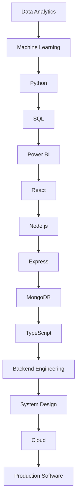
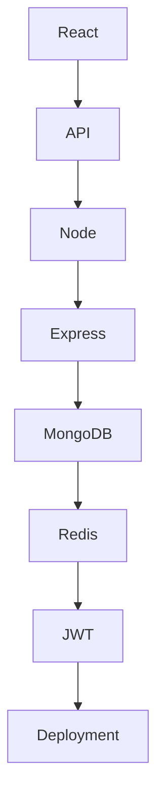
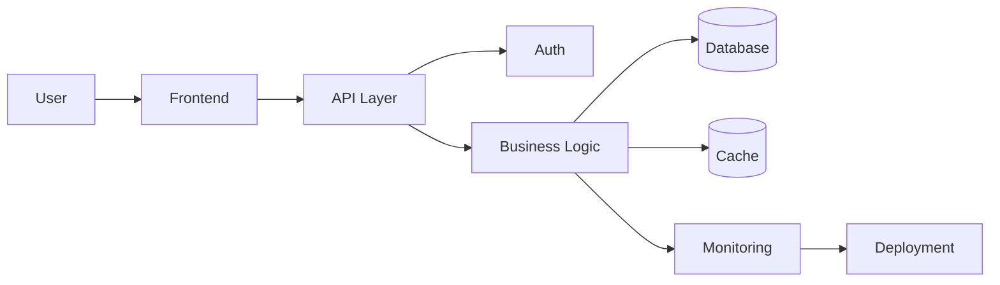
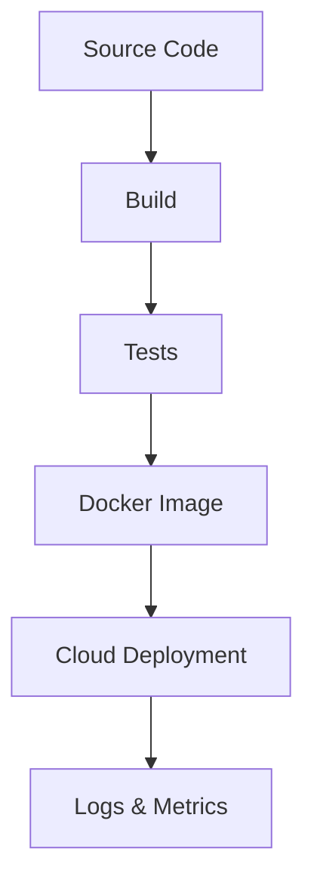
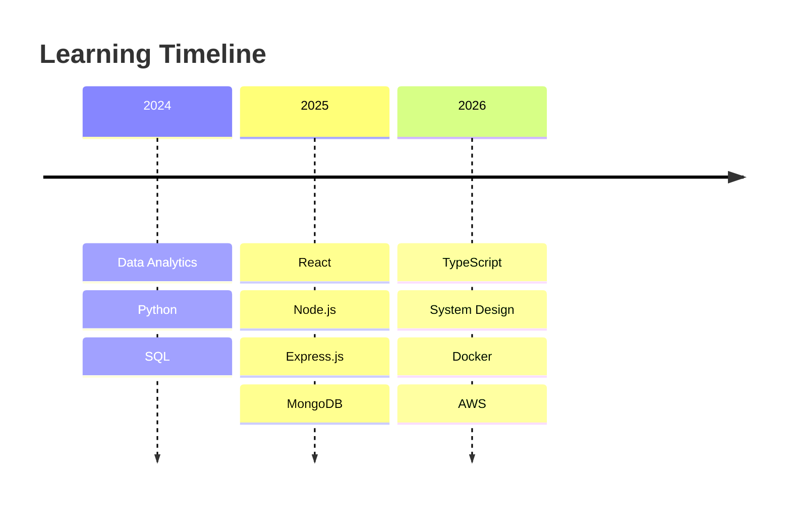

<!-- ========================================================= -->
<!--  YASH KAGRA — GITHUB PROFILE README                       -->
<!-- ========================================================= -->

<div align="center">

  <a href="https://github.com/YOUR-USERNAME">
    
  </a>

  

  <br />

  <a href="https://github.com/YOUR-USERNAME">
    
  </a>
  <a href="https://www.linkedin.com/in/YOUR-LINKEDIN">
    
  </a>
  <a href="mailto:YOUR_EMAIL@example.com">
    
  </a>
  <a href="https://YOUR-PORTFOLIO.com">
    
  </a>

  <br /><br />

  

</div>

<br />

<div align="center">

<table>
<tr>
<td align="center"><b>Owner</b><br/>Yash Kagra</td>
<td align="center"><b>Education</b><br/>B.Tech Computer Science</td>
<td align="center"><b>Location</b><br/>India</td>
<td align="center"><b>Focus</b><br/>Backend · ML · Data</td>
</tr>
</table>

</div>

---

## Terminal

<div align="center">

```bash
> whoami

Yash Kagra
Software Engineer
Backend Developer
Machine Learning Enthusiast
Data Analyst

> location
India

> mission
Build scalable software that solves real-world problems.

> learning
TypeScript
Backend Engineering
System Design
Cloud
Docker
AWS
```

</div>

---

## About Me

I approach software the way strong engineers approach systems: start with the problem, understand the constraints, and design for what will still matter after the first release. I enjoy turning vague ideas into working products, then tightening the loop until the experience feels deliberate, stable, and fast.

My background sits at the intersection of engineering and applied problem solving. That means I care about code quality, but I care just as much about how a product behaves under load, how easily it can be maintained, and whether the interface helps the user move without friction. I like owning outcomes, not just tasks.

I learn best by building. That usually means reading enough to understand the trade-offs, then going hands-on until the system reveals where the real complexity is. Over time, that habit has shaped how I write code, how I review architecture, and how I think about software craftsmanship.

---

## Engineering Journey



---

## Tech Stack

<table>
<tr>
<td valign="top" width="33%">

### Languages
<p>
  
  
  
  
</p>

### Frontend
<p>
  
  
  
</p>

### Backend
<p>
  
  
  
</p>

</td>
<td valign="top" width="33%">

### Databases
<p>
  
  
  
</p>

### Cloud
<p>
  
  
  
</p>

### DevOps
<p>
  
  
  
</p>

</td>
<td valign="top" width="33%">

### Machine Learning
<p>
  
  
  
</p>

### Analytics
<p>
  
  
  
</p>

### Tools
<p>
  
  
  
</p>

### Version Control
<p>
  
  
</p>

</td>
</tr>
</table>

</table>

---

## Engineering Philosophy

I care about software that stays understandable after the excitement of the first build fades. Readability is not a cosmetic preference to me; it is what makes maintenance possible and collaboration efficient.

I optimize for stability before sophistication, and for clarity before cleverness. If a system can be simpler, easier to test, and easier to evolve without losing performance or intent, that is usually the better design.

User experience is part of engineering, not an afterthought. A technically correct product that feels slow, noisy, or confusing is still incomplete.

---

## Current Focus

<div align="center">

<table>
<tr>
<td width="25%" align="center">

### Currently Learning
TypeScript<br/>Node.js<br/>Express.js<br/>MongoDB

</td>
<td width="25%" align="center">

### Building
Cable One<br/>Student Burnout Prediction<br/>Payment Analytics Dashboard<br/>Uber Route Analytics

</td>
<td width="25%" align="center">

### Reading
Backend architecture<br/>System design patterns<br/>Product engineering notes

</td>
<td width="25%" align="center">

### Practicing
DSA<br/>API design<br/>Debugging<br/>Deployment

</td>
</tr>
</table>

</div>

---

## Featured Projects

<details open>
<summary><strong>Cable One</strong></summary>

<br />

<table>
<tr>
<td width="38%" valign="top">

**Architecture**  
Frontend → API → Services → Database → Deployment

**Tech Stack**  
React, Node.js, Express, MongoDB, TypeScript, Docker

**Features**  
- Production-oriented service flow.
- Clean interface with performance in mind.
- Modular backend structure.
- Scalable data handling.

</td>
<td width="62%" valign="top">

**Challenge**  
Designing a system that stays maintainable as features expand.

**Lesson**  
Good structure reduces future cost more than fast shortcuts reduce current effort.

**Scalability**  
Prepared for feature growth, role expansion, and service decomposition.

**Future Improvements**  
- Caching layer.
- Background jobs.
- Observability.
- Deployment hardening.

**Demo**  
[Live Demo](#) · [GitHub Repo](#)

<br />


</td>
</tr>
</table>

</details>

<details>
<summary><strong>Student Burnout Prediction</strong></summary>

<br />

<table>
<tr>
<td width="38%" valign="top">

**Architecture**  
Data collection → preprocessing → model training → evaluation → inference

**Tech Stack**  
Python, pandas, NumPy, scikit-learn, Jupyter, Power BI

**Features**  
- Predictive modeling workflow.
- Data cleaning and feature engineering.
- Insight-oriented evaluation.
- Interpretable outcome focus.

</td>
<td width="62%" valign="top">

**Challenge**  
Balancing predictive performance with explainability.

**Lesson**  
A model is only useful when the output can be trusted and acted upon.

**Scalability**  
Can evolve into a larger analytics platform with better data ingestion and monitoring.

**Future Improvements**  
- Model comparison.
- API wrapper.
- Dashboard integration.
- Drift monitoring.

**Demo**  
[Live Demo](#) · [GitHub Repo](#)

<br />


</td>
</tr>
</table>

</details>

<details>
<summary><strong>Payment Analytics Dashboard</strong></summary>

<br />

<table>
<tr>
<td width="38%" valign="top">

**Architecture**  
Payments data → ETL → analytics layer → dashboard → insights

**Tech Stack**  
React, Node.js, MongoDB, SQL, Power BI, REST APIs

**Features**  
- Transaction-level analytics.
- KPI visualizations.
- Trend tracking.
- Decision-friendly dashboarding.

</td>
<td width="62%" valign="top">

**Challenge**  
Creating meaningful business views from noisy transaction data.

**Lesson**  
Analytics matters when it reduces ambiguity, not when it only increases chart count.

**Scalability**  
Structured to support larger volumes and additional metrics.

**Future Improvements**  
- Role-based filtering.
- Export support.
- Scheduled refresh.
- Alerting.

**Demo**  
[Live Demo](#) · [GitHub Repo](#)

<br />


</td>
</tr>
</table>

</details>

<details>
<summary><strong>Uber Route Analytics</strong></summary>

<br />

<table>
<tr>
<td width="38%" valign="top">

**Architecture**  
Location data → route modeling → analytics engine → visualization

**Tech Stack**  
Python, SQL, pandas, geospatial analysis, dashboard tools

**Features**  
- Route pattern analysis.
- Efficiency insights.
- Travel-time perspective.
- Operational reporting support.

</td>
<td width="62%" valign="top">

**Challenge**  
Making route data understandable without oversimplifying it.

**Lesson**  
Strong analytics reveals movement patterns that raw data hides.

**Scalability**  
Can extend to larger mobility datasets and predictive routing use cases.

**Future Improvements**  
- Heatmaps.
- Time-window analysis.
- Density clustering.
- Interactive visual exploration.

**Demo**  
[Live Demo](#) · [GitHub Repo](#)

<br />


</td>
</tr>
</table>

</details>

---

## System Architecture







---

## Developer Statistics

<div align="center">

<table>
<tr>
<td></td>
<td></td>
</tr>
<tr>
<td></td>
<td></td>
</tr>
</table>


</div>

---

## Coding Profiles

<table>
<tr>
<td><a href="https://github.com/YOUR-USERNAME">GitHub</a></td>
<td><a href="https://www.linkedin.com/in/YOUR-LINKEDIN">LinkedIn</a></td>
<td><a href="https://YOUR-PORTFOLIO.com">Portfolio</a></td>
<td><a href="https://leetcode.com/u/YOUR-LEETCODE/">LeetCode</a></td>
</tr>
<tr>
<td><a href="https://codeforces.com/profile/YOUR-CODEFORCES">Codeforces</a></td>
<td><a href="https://www.hackerrank.com/YOUR-HACKERRANK">HackerRank</a></td>
<td><a href="https://www.geeksforgeeks.org/user/YOUR-GFG/">GeeksforGeeks</a></td>
<td><a href="mailto:YOUR_EMAIL@example.com">Email</a></td>
</tr>
<tr>
<td><a href="https://YOUR-RESUME-LINK.pdf">Resume</a></td>
<td colspan="3"></td>
</tr>
</table>

---

## Achievements

<table>
<tr>
<td>

### Certifications
- Full-stack development.
- Data analytics.
- Cloud fundamentals.

</td>
<td>

### Internships
- Software engineering exposure.
- Product-building experience.
- Data-focused projects.

</td>
<td>

### Major Projects
- Cable One.
- Student Burnout Prediction.
- Payment Analytics Dashboard.
- Uber Route Analytics.

</td>
</tr>
<tr>
<td>

### Technical Skills
- MERN stack.
- Python.
- SQL.
- Data analysis.

</td>
<td>

### Open Source
- Readme improvements.
- UI polish contributions.
- Documentation-focused work.

</td>
<td>

### Leadership
- Ownership in project delivery.
- Independent problem solving.
- Consistent learning discipline.

</td>
</tr>
</table>

---

## Learning Timeline



---

## Currently Building

<div align="center">

### Cable One

**Production Ready**

`██████████░░░░░░░░░░` 60%

**Upcoming Features**
- Authentication.
- Role-based access.
- Analytics layer.
- Deployment pipeline.

**Future Roadmap**
- Caching.
- Background workers.
- Monitoring.
- Scalability improvements.

</div>

---

## Future Goals

- Become a strong backend engineer.
- Deepen distributed systems understanding.
- Build cloud-native services.
- Design microservices with clarity.
- Contribute to open source with consistency.
- Improve system design depth.
- Add AI integration where it creates real value.

---

## Footer

<div align="center">


<br />


<p>
  <strong>Thank you for visiting.</strong><br/>
  Built with intent, maintained with discipline, and shaped by continuous iteration.
</p>

<p>
  <sub>Yash Kagra • Software Engineering • Backend • Data • Systems</sub>
</p>

</div>
